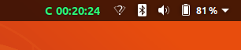

# Etecsa Login Gnome Shell Extension

gnome shell extension for etecsa login



## Usage

Click to login or logout

- _Green_: you are connected
- _Yellow_: connected through another interface
- _Normal_: disconnected
- _Red_: error

## Dependencies

- npm
- nodejs
- [etecsa-cli](https://github.com/danielpza/etecsa-cli) (npm package)

## Install

```sh
npm i -g etecsa-cli # install etecsa-cli dependency
etecsa set myuser mypassword
git clone https://github.com/danielpza/etecsa-login-gnome-shell-extension.git ~/.local/share/gnome-shell/extensions/Etecsa_Login_Manager@danielpza@protonmail.com
```

Open Gnome Tweaks and enable the extension
